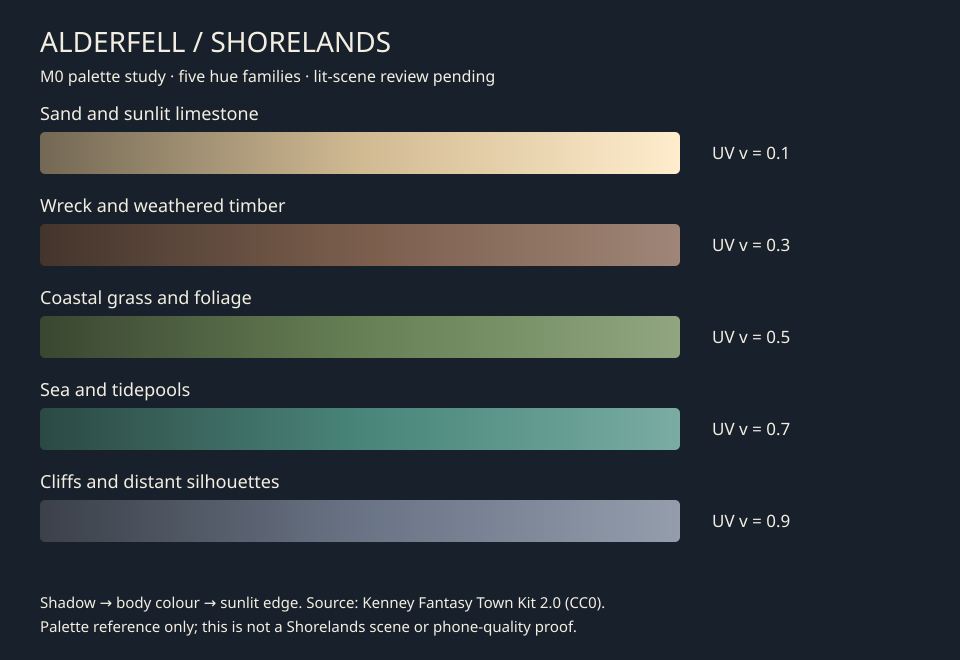

# M0 Shorelands palette foundation

Owner: Codex, 2026-09-02. Branch: `codex/m0-shorelands-foundation`.
Task M0-01 is in review: source, atlas and UV contract are committed; Unity import
and lit-scene review remain pending. This is a colour study, not the beauty proof.

## Art direction

Warm sand welcomes the player; cool slate cliffs frame a desaturated teal sea.
Muted yellow-green foliage leads the eye up the switchback. Wreck timber uses
the darkest warm band. Save the lightest sand values for foam, exposed rock edges
and the eventual landmark highlight, so the entire coast is not equally bright.
These are five dominant hue families, with value/saturation variation within each.
This palette is provisional until the phone reveals pass GDD §36.

## Source and reproduction

- Base: [Kenney Fantasy Town Kit 2.0](https://kenney.nl/assets/fantasy-town-kit),
  CC0; checked 2026-09-02. The downloaded colormap SHA-256 matches the existing
  project's LFS pointer: `4aac939dc33195e35caf8c382ee3cb170054da763577f22d3c22692ec6afccdf`.
- Exact download, archive member, sample coordinates and RGB values are recorded
  in [shorelands.json](../art/palettes/shorelands.json). Coordinates are measured
  from the source image's top-left. Tuned HSV values deliberately reduce saturation
  and move the vegetation/sea toward a temperate coast.
- Preserve the original source under the existing Kenney asset path. The copied
  [source notice](../art/palettes/KENNEY_LICENSE.txt) remains beside editable palette data.
- Run `python3 tools/build_shorelands_palette.py` from the repository root after
  editing JSON. No Python packages or source download are needed to rebuild.
  Commit JSON, generated PNG and SVG together. `--check` is read-only and runs in CI.
- The generator is the canonical authoring path for this first atlas; GIMP may be
  used to inspect it. Do not independently paint over the generated PNG.

## Texture and UV contract — layout version 1

Runtime texture: `unity/Assets/Isoperia/Art/Textures/shorelands_atlas.png`.
256×160 RGB, five horizontal bands of 32 identical rows. Sand is the bottom band
in Unity UV coordinates (the bottom of the PNG). Each band progresses left to
right from shadow through body colour to highlight. This is albedo, not baked lighting.

| Band, bottom to top | Role | Centre V | Source sample RGB | Tuned HSV (degrees, 0–1, 0–1) |
|---|---|---|---|---|
| 0 · sand | Beach, limestone, foam | 0.1 | 250, 221, 186 | 38, 0.30, 0.82 |
| 1 · timber | Wreck, driftwood | 0.3 | 164, 93, 65 | 22, 0.38, 0.48 |
| 2 · grass | Grass, foliage | 0.5 | 73, 175, 127 | 95, 0.34, 0.50 |
| 3 · sea | Ocean, tidepools | 0.7 | 92, 189, 166 | 169, 0.45, 0.52 |
| 4 · slate | Cliffs, distant rock | 0.9 | 121, 127, 149 | 218, 0.21, 0.52 |

For Blender meshes, place a surface's V at its band's centre and vary U for the
desired tonal gradient. Safe U range: `0.5/256` through `255.5/256`.
For shader sampling use `u = (0.5 + saturate(t) * 255) / 256`,
`v = (band + 0.5) / 5`. Do not interpolate V across bands to blend terrain;
sample each chosen band at its centre, then blend colours with normalized weights.

Importer metadata requests sRGB colour, bilinear filtering, clamp wrapping,
no mipmaps, no NPOT resizing, no alpha and no compression. With no mipmaps and
centre-V sampling, neighbouring bands cannot bleed into a surface. GPU memory
is approximately 160 KiB if Unity expands this to RGBA32; confirm the actual format
in the Editor. Disabling compression here preserves a tiny gradient; this is not
a project-wide exception to mobile texture budgets.

This one generated PNG is stored inline in Git, through an exact-path attribute,
so the read-only CI generator check needs no LFS download. Other textures retain
their existing LFS rules. Metadata GUIDs are new and have not been Editor-imported.

Do not reorder bands or resize the atlas after authoring UVs without a layout
migration. A future shared atlas covering more regions must preserve these UVs
or explicitly remap admitted meshes; this study does not lock that later layout.

## Next session and acceptance

1. Open this branch's `unity/` project in Unity 6000.5.8f1. Confirm the checkout,
   active scene, Play Mode and unsaved changes before editor writes.
2. Import the atlas; check dimensions, colour space, wrapping, mipmaps, compression
   and platform overrides. Check for Console errors. Do not edit the existing
   Kenney materials to point at this incompatible layout.
3. Begin M0-02: world/terrain atlas sampling, then vegetation wind and water/foam.
   Test sampling in a lit review scene and compare each band at phone scale.
   Shader compilation and actual render evidence are required before verification.
4. M0-03 creates an isolated scene; inspect and exclude legacy runtime auto-starts
   before entering Play Mode. No old gameplay bootstrap, save driver or world
   population may run in the proof.
5. Continue the GDD's terrain/landform/scatter/reveal tasks. Record measured hands-on
   authoring duration per session, device/build/settings and captures. No authoring
   duration or device performance is inferred from this remote palette work.

No Unity or Blender connection was available during this change. No scene,
material, shader, gameplay or ProjectSettings file was changed.
