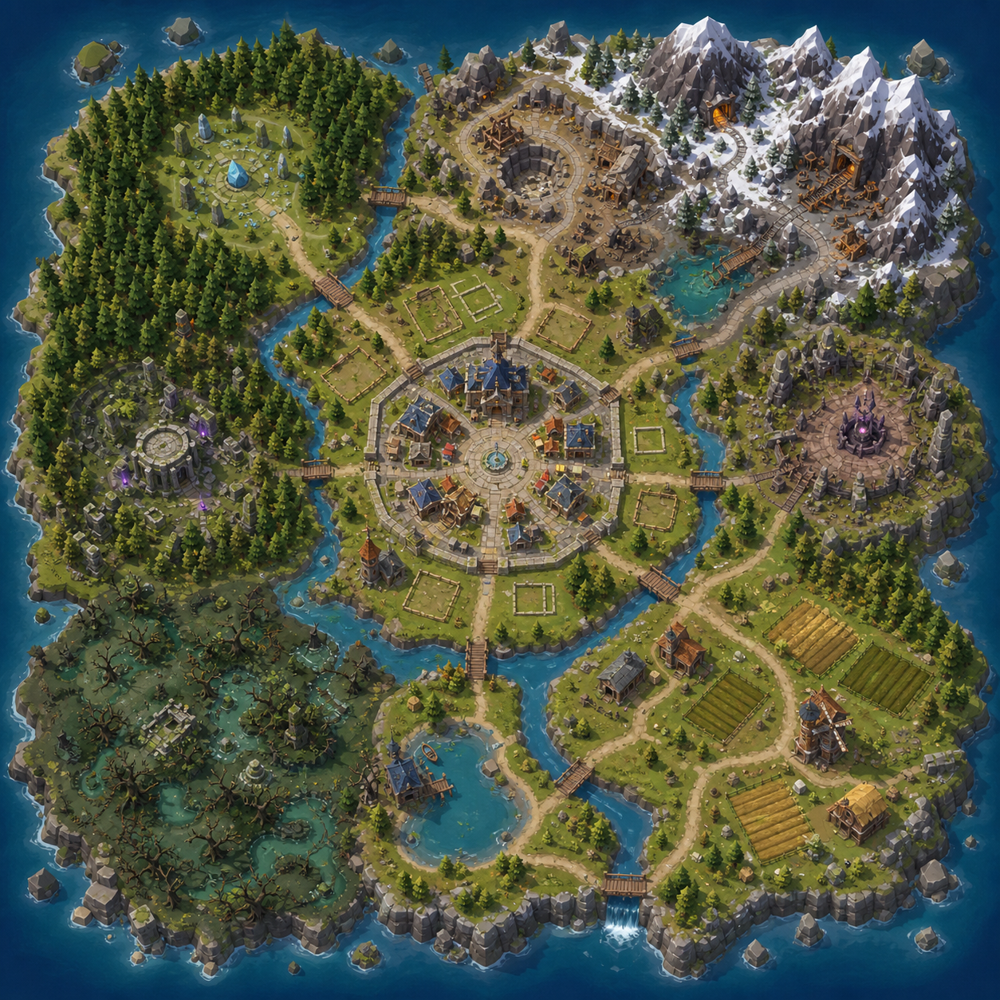
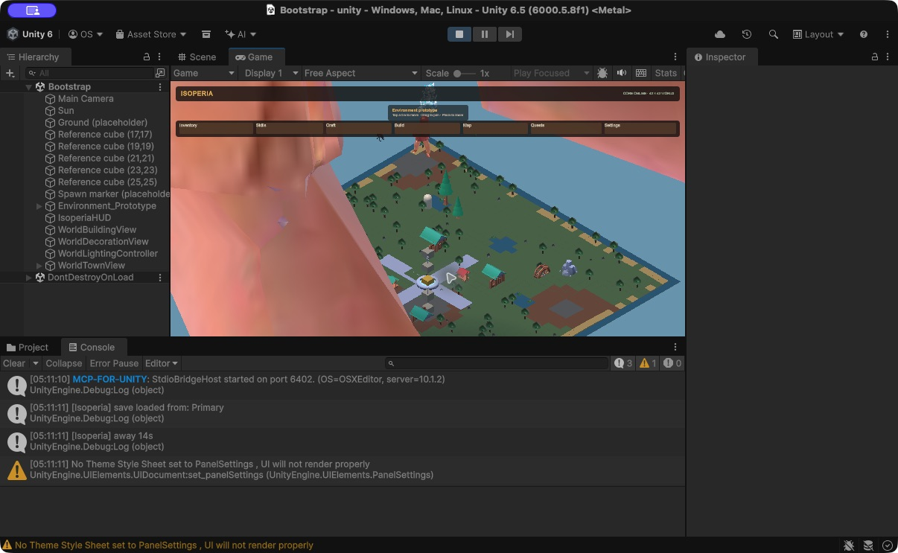

# Isoperia World Layout — v1

The Unity world should read as one place from the camera: a safe settlement at
its center, clear landmark-led routes, and four outer regions whose terrain,
resource loop, NPCs, and danger reinforce one another. The image is a design
reference, not a literal tile map or an asset source.

## Spatial contract

| Area | Role | Primary content |
| --- | --- | --- |
| Central settlement | safe home and construction area | Town Hall, market, campfire, villagers, build plots, storage |
| Northwest forest | first gathering route | normal/oak trees, shrine/ruin landmark, early wildlife |
| Northeast highlands | mining progression | copper/tin near route, iron/coal deeper, mine and snow-crag landmarks |
| Southwest mire | mid-game route | willow trees, fishing water, bog husks, hazardous swamp paths |
| Southeast lowlands | food and town growth | farm plots, fishing, mills/granary, cooking/carpentry loop |
| Outer east | high-risk destination | dungeon approach, boss clearing, stronger encounters |

## Layout rules

- Keep the settlement visually open; buildings sit around a walkable square,
  never as an opaque ring around the player spawn.
- Place a single obvious landmark at the entrance to every biome, with a road or
  bridge that makes the intended route visible from the isometric camera.
- Cluster functional objects: forge/smelter near the quarry route, campfire and
  market near the square, farm structures next to fields and water.
- Resource nodes grow denser away from the settlement, but preserve paths and
  leave room for NPC staging, combat clearings, and future quest objects.
- Use water, cliffs, bridges, and gates as readable soft progression boundaries;
  do not rely on invisible blockers.
- Treat each route as a loop back to town, rather than a dead-end corridor.

## Free-asset shortlist

Use only the listed license terms and retain each downloaded pack's license
file in `docs/THIRD_PARTY_ASSETS/` before import.

1. [Kenney Nature Kit](https://kenney.nl/assets/nature-kit) — CC0; trees, rocks,
   and foliage. Best fit for replacing the current resource-prop prototypes.
2. [Kenney Fantasy Town Kit](https://opengameart.org/content/fantasy-town-kit)
   — CC0; 160+ low-poly modular town pieces in FBX/OBJ/glTF. Best fit for the
   settlement and player-built structures.
3. [Low-Poly Fantasy Environment](https://opengameart.org/content/low-poly-fantasy-environment)
   — CC0; lightweight towers, rocks, and landmark props.
4. [3D Low-Poly RPG Level Models](https://opengameart.org/content/3d-low-poly-rpg-level-models)
   — CC0; optional smith house, village walls, chests, and trees.
5. [Unity Asset Store: Low Poly Environment — Nature Free](https://assetstore.unity.com/top-assets/top-free)
   — Unity Asset Store EULA; use only after verifying the package's current
   URP/Unity 6 compatibility and retaining its license information.

Do not download/import paid, attribution-unclear, or incompatible packages.

## Imported town foundation (2026-08-22)

The first imported building kit is **Kenney Fantasy Town Kit 2.0**, mirrored by
OpenGameArt under **CC0**. The Unity project contains a deliberately small,
curated subset in `Assets/Isoperia/Resources/Art/KenneyFantasyTown/` rather than
the entire archive: modular house pieces, roads, market stalls, lanterns,
fountain, fences, trees, rocks, windmill, watermill, and its shared colour atlas.

`WorldTownView` composes these into a fixed central settlement: a crossroad plaza
and fountain, market stalls along its paths, four homes around the civic core,
and farm/production space at the south-east/west edges. This is presentation
only—the Core building system remains the owner of player-placed buildings.

The next environment import remains Polytope Studio's **Low Poly Environment –
Nature Free** from the Unity Asset Store. It is free and URP-compatible, but
requires adding it to the project's Unity Asset Library before it can be brought
into the editor.
